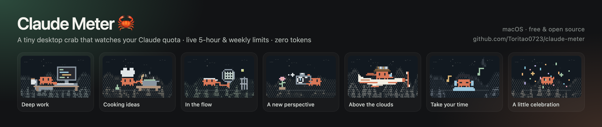
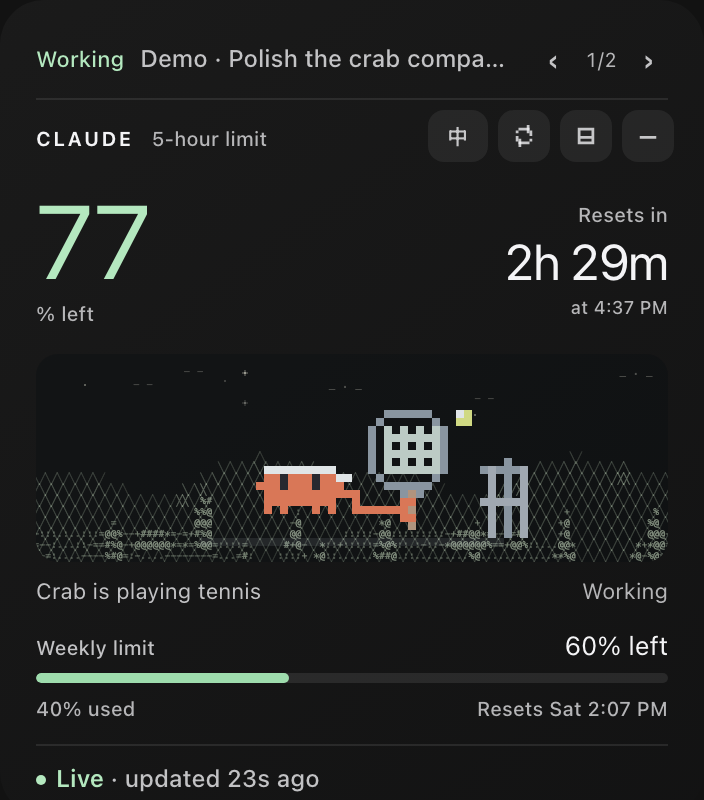

# Claude Meter 🦀

A tiny desktop crab for macOS that shows your **remaining Claude quota** live and keeps you company while Claude Code works.

一只 macOS 桌面小螃蟹：实时显示 **Claude 剩余额度**，陪你等 Claude Code 干活。

> **Two apps, two download pages.** This page is for **Claude**. Using Codex? Get the Codex version at **[Toritao0723/codex-meter](https://github.com/Toritao0723/codex-meter)**.
> 这里是 **Claude 版**；想要 **Codex 版**请去 [codex-meter](https://github.com/Toritao0723/codex-meter) 下载。

| Full panel | Compact |
|---|---|
|  |  |

中文界面：[media/claude-meter-zh.png](media/claude-meter-zh.png)

## What it does

- **Live Claude quota** — 5-hour and weekly limits (plus weekly Opus / Sonnet when your plan has them), remaining %, and reset countdowns. The same numbers as Claude's Usage page, refreshed every 60 s.
- **Claude Code sessions** — recent sessions on this Mac in a one-line task bar, with working / done states, a notification when a turn finishes, and context fill.
- **Seven pixel scenes** — the crab types, cooks, plays tennis, takes photos and flies while Claude works; listens to music while waiting; throws confetti when a turn ends.
- **中文 / English** — switch with the **EN / 中** button in the full panel, or right-click → Switch to English.
- **Three sizes** — full panel, compact bar, and crab-only. Native macOS glass, light / dark / match system.

## Install

Requirements: macOS 13+ (Apple Silicon or Intel), Claude Code, and a Claude subscription. The Intel half of the app was smoke-tested under Rosetta (it launches, syncs and shows the quota) but not yet on a real Intel Mac.

**One command** (downloads the latest release, checks its checksum, installs to `~/Applications` and opens it; [read the script](install.sh) first if you like):

```sh
curl -fsSL https://raw.githubusercontent.com/Toritao0723/claude-meter/main/install.sh | bash
```

Or step by step:

1. **Sign in Claude Code once** (the meter uses this sign-in to read your quota):
   ```sh
   claude auth login
   ```
2. **Download** `Claude-Meter-macOS.zip` from [Releases](../../releases), unzip it, and move `Claude Meter.app` to `~/Applications`.
3. **Open it.** The app is ad-hoc signed, not Apple-notarized, so the first time: right-click the app → **Open** → **Open**. Or run:
   ```sh
   xattr -dr com.apple.quarantine "$HOME/Applications/Claude Meter.app"
   ```
4. If macOS asks to use the **"Claude Code-credentials"** keychain item, choose **Always Allow**.

### Build from source

Needs Apple Command Line Tools (`xcode-select --install`).

```sh
python3 -m unittest -v test_bridge.py
./build.sh
ditto "/private/tmp/claude-meter-build/Claude Meter.app" "$HOME/Applications/Claude Meter.app"
open "$HOME/Applications/Claude Meter.app"
```

JavaScript tests, if Node.js is installed: `node --test test_task_nav.cjs test_pet.cjs`.

## Quota not showing?

Run the self-check. It tests every step and says which one fails (it prints no tokens and changes nothing):

```sh
curl -fsSL https://raw.githubusercontent.com/Toritao0723/claude-meter/main/doctor.sh | bash
```

**Claude Code missing or not signed in** (the most common cause on a new Mac; the meter reads Claude Code's sign-in, not the Claude desktop app's). This installs it if needed, uses your system proxy automatically, and signs in:

```sh
curl -fsSL https://raw.githubusercontent.com/Toritao0723/claude-meter/main/setup-claude-code.sh | bash
```

The footer of the full panel also says why it is not synced (hover it for what to do):

| The footer says | What it means | Fix |
|---|---|---|
| sign in again · 请重新登录 | Claude Code is not installed or not signed in on this Mac. The meter reads **Claude Code's** sign-in, not the Claude desktop app's. | Run the setup script (below). **Behind a proxy app (Clash...), Terminal does not use the system proxy by itself**: from Hong Kong the plain `curl -fsSL https://claude.ai/install.sh \| bash` is answered with an "unavailable in your region" web page and installs nothing. The setup script picks up your system proxy, installs Claude Code, and signs in |
| login expired · 登录已过期 | The 8-hour sign-in ran out and renewing it did not work | Check your proxy region, or run `claude auth login` again |
| region blocked · 地区受限 | Anthropic answered 403: your network exits from an unsupported region (Hong Kong, mainland China...) | Switch your proxy node to Japan, the US or Singapore |
| no connection · 网络不通 | No route to Anthropic | Check your internet connection or proxy |
| rate limited · 请求太频繁 | Too many requests in a short time | Nothing: it retries by itself in a few minutes |
| (the meter does not appear at all) | Apple's Command Line Tools may be missing, which the helper needs for Python 3 | `xcode-select --install`, then reopen Claude Meter |

## Good to know

- **Region:** Anthropic rejects requests from unsupported regions (for example Hong Kong): `claude auth login` fails with 403 and the meter shows a sync error. Use a network in a supported region. The meter follows the macOS system proxy.
- **Pink number = not synced.** If a refresh fails (offline, signed out, region), the number turns pink and the footer says so. A stale number never passes for a live one.
- **The sign-in lasts about 8 hours, and the meter renews it for you.** The access token Claude Code saves expires after roughly 8 hours, which usually happens while your Mac sleeps. When the meter finds it expired (it also syncs right after the Mac wakes), it starts the `claude` command once and **Claude Code renews its own sign-in**. That run is a no-op slash command (`claude -p /claude-meter-renew`, answered "Unknown skill"), so it uses **no tokens**, and Claude Meter never writes your credentials itself. If a run ever reported a cost, the meter would switch the feature off by itself. To turn it off yourself: right-click → **Auto-renew sign-in**. If it can't renew (Claude Code not installed, signed out, or a blocked region), the footer says why instead of showing a stale number.
- **Privacy:** the access token is read locally from the macOS Keychain (or `~/.claude/.credentials.json`) and sent only to Anthropic's official read-only usage endpoint. The meter only ever reads it; renewing is done by Claude Code, not by this app. Session tracking reads only `~/.claude/projects/*.jsonl` on this Mac. No model requests, no analytics, nothing else leaves your Mac.
- "Done" means the current response turn ended, not that the whole project is finished.

## Files

| File | What it is |
|---|---|
| `Meter.swift` | The macOS window, menu, notifications and bridge process. |
| `bridge.py` | Reads Claude quota and Claude Code sessions; prints JSON to the app every 2 s. |
| `ui/` | The panel: layout, pixel crab, scenes, task bar. Open `ui/index.html?state=ok&lang=en` in a browser to preview with demo data (`&mini=1`, `&minimized=1`, `&theme=light`). |
| `build.sh` | Builds and ad-hoc signs `Claude Meter.app`. |

## Credits

Based on [Bon Yeung's Claude-Meter](https://github.com/bonyuiux/Claude-Meter). Original UI and pixel character © 2026 Bon Yeung; the original documentation is kept in [UPSTREAM.md](UPSTREAM.md). Character landscapes adapt [Tori Patterns Photo Lab](https://patterns.toritao.com/#/photo). Built by Tori with Claude and Codex.

Unofficial fan project — not made or endorsed by Anthropic.
